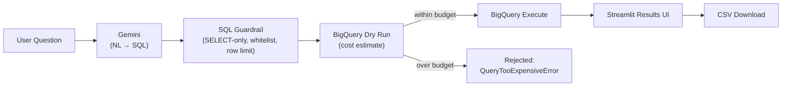
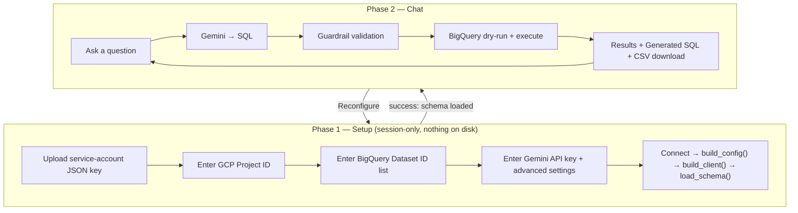
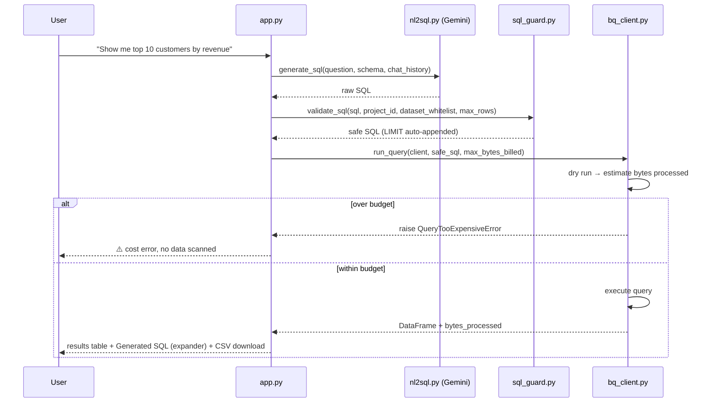

# BigQuery NL Chatbot — Architecture & Technical Overview

A Streamlit app that lets anyone ask questions about their BigQuery data in
plain English. Gemini translates the question into SQL grounded on the
real schema, a guardrail layer sanitizes it, BigQuery dry-runs it for cost
before executing, and the results are shown in-app and downloadable as CSV.

---

## 1. Use Cases

| Use case | How the app supports it |
|---|---|
| **Self-service analytics for non-technical users** | Business users ask questions in English instead of writing SQL — e.g. "What were total sales by region last quarter?" |
| **Ad-hoc exploration / drill-down** | Follow-up questions reuse conversation context — e.g. "now filter by region", "only show the top 5" |
| **Bring-your-own BigQuery project** | Any client can upload their own service-account key and point the app at their own project/datasets — no shared backend credentials, no multi-tenant data leakage |
| **Safe read-only querying** | Because the SQL guardrail blocks anything but `SELECT`, the app is safe to hand to users who shouldn't be able to modify data, even if the underlying service account were ever over-permissioned |
| **Cost-governed querying** | Teams worried about runaway BigQuery bills can rely on the dry-run + byte-scan cap so no single question can scan an entire warehouse by accident |
| **Quick data export** | Any result set can be downloaded as CSV for further analysis in Excel/Sheets |

---

## 2. Architecture

### 2.1 High-level data flow



### 2.2 Two-phase application flow

The app gates the chat experience behind a one-time, fully client-side
setup phase — nothing is read from a `.env` file or server-side secret
store. Everything the app needs (credentials, project, datasets, Gemini
key) is provided by whoever is using it, for that session only.



### 2.3 Sequence for a single chat turn



### 2.4 Module breakdown

| File | Responsibility | Key exports |
|---|---|---|
| `app.py` | Streamlit UI: setup wizard (phase 1) + chat (phase 2), session-state orchestration | `_render_setup_form`, `_render_chat` |
| `config.py` | Validates raw setup-form input into an immutable config object | `Config`, `build_config`, `DEFAULT_GEMINI_MODEL`, `DEFAULT_MAX_BYTES_BILLED`, `DEFAULT_MAX_ROWS` |
| `bq_client.py` | Builds the BigQuery client from the uploaded key, dry-runs for cost, executes | `build_client`, `estimate_bytes_processed`, `run_query`, `QueryTooExpensiveError` |
| `schema_loader.py` | Reads live table/column metadata from `INFORMATION_SCHEMA` so the LLM is grounded on real schema, not guesses | `load_schema` |
| `nl2sql.py` | Sends the question + schema + chat history to Gemini, extracts the SQL from the response | `generate_sql`, `NL2SQLError` |
| `sql_guard.py` | Defense-in-depth: blocks non-`SELECT`/DDL/DML, enforces single statement, enforces project+dataset whitelist, auto-appends `LIMIT` | `validate_sql`, `SQLGuardError` |
| `export.py` | Converts a result DataFrame into downloadable CSV bytes | `to_csv_bytes` |

---

## 3. Technology Stack

| Layer | Technology | Notes |
|---|---|---|
| **UI framework** | [Streamlit](https://streamlit.io/) `>=1.32` (dev env has 1.58.0) | Chat-style interface, session state, file uploader, forms |
| **LLM / NL→SQL** | Google **Gemini** (`gemini-2.5-flash` default, configurable) via the **`google-genai`** SDK `>=1.0` | Uses the current unified Google GenAI SDK — the older `google-generativeai` package is fully deprecated and was intentionally avoided |
| **Data warehouse** | **Google BigQuery** via `google-cloud-bigquery` `>=3.17` | Dry-run cost estimation + query execution; results pulled as a pandas DataFrame |
| **Authentication** | `google-oauth2` `service_account` credentials | Built from a client-uploaded service-account JSON key, held only in memory for the session (never written to disk) |
| **Data handling** | `pandas` `>=2.0`, `db-dtypes` `>=1.2`, `pyarrow` `>=14.0` | `db-dtypes`/`pyarrow` are required for BigQuery's `to_dataframe()` conversion |
| **SQL parsing/validation** | `sqlparse` `>=0.4.4` | Used by the guardrail layer to confirm a single `SELECT`/`WITH` statement |
| **Language/runtime** | Python (dev env: 3.14) | No framework-specific runtime beyond Streamlit's own server |

Dependency list lives in [requirements.txt](requirements.txt).

---

## 4. Security Model / Guardrails

Defense in depth — no single layer is trusted alone:

1. **Read-only service account** (recommended `roles/bigquery.dataViewer` +
   `roles/bigquery.jobUser`) — the first and most important layer.
2. **SQL guardrail** (`sql_guard.py`) — blocks any statement that isn't a
   single `SELECT`/`WITH`, rejects forbidden keywords (`INSERT`, `UPDATE`,
   `DELETE`, `MERGE`, `DROP`, `CREATE`, `ALTER`, `TRUNCATE`, etc.), and
   requires every referenced table to match the connected project and the
   user-selected dataset whitelist.
3. **Row limiting** — any generated query without an explicit `LIMIT` gets
   one appended automatically.
4. **Cost control** (`bq_client.py`) — every query is dry-run first; if the
   estimated bytes scanned exceeds the configured cap, it's rejected before
   ever touching real data.
5. **Session-only secrets** — the uploaded service-account key and the
   Gemini API key live only in `st.session_state` for that browser session;
   nothing is persisted to disk or `.env`. Clicking "Reconfigure" discards
   them entirely.

---

## 5. Current Prototype Status

### Implemented today
- Fully client-side, self-serve setup flow (upload key → enter project ID
  → enter dataset ID(s) → enter Gemini key → connect)
- Schema-grounded NL→SQL translation via Gemini, with multi-turn follow-up
  support (session-scoped query history)
- Full guardrail + cost-control pipeline described above
- Chat UI with generated-SQL transparency (expandable) and CSV export
- No server-side configuration required at all

### Prototype / discussed but not yet built (roadmap)
- **Dataset auto-discovery**: instead of the user typing dataset IDs by
  hand, connect first, call BigQuery's `list_datasets()` for the given
  project, and let the user pick from a real list (with a manual-entry
  fallback for datasets only granted at the dataset-IAM level). Designed
  but not implemented.
- GCS signed URL export as an alternative to direct CSV download, for
  deployments needing a persistent shareable link
- Chart auto-generation for numeric results
- Explicit "edit last query" intent handling for multi-turn refinement
- Per-user query audit logging

---

## 6. Project Structure

```
app.py            Streamlit chat UI: setup form (phase 1) + chat (phase 2)
config.py         Config model + validation for setup-form input
schema_loader.py  Pulls live schema from BigQuery INFORMATION_SCHEMA
nl2sql.py         Gemini-based NL → SQL translation (google-genai SDK)
sql_guard.py      Validates/sanitizes generated SQL
bq_client.py      BigQuery execution with dry-run cost check
export.py         DataFrame → CSV bytes for download
requirements.txt  Python dependencies
.gitignore        Keeps stray key files, .env, __pycache__ out of git
README.md         Setup instructions and feature overview
```

See [README.md](README.md) for setup and running instructions.